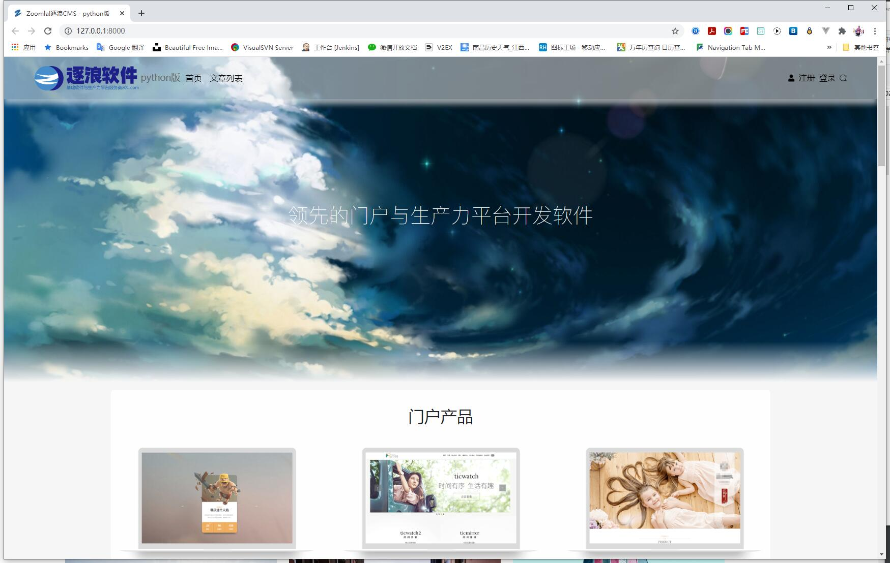

 

# ZoomlaCMS Python版
> V1.0 发布于2021-01-25

<!-- TOC -->

- [ZoomlaCMS Python版](#zoomlacms-python版)
    - [关于逐浪CMS](#关于逐浪cms)
    - [项目说明](#项目说明)
        - [1️⃣自由开放](#1️⃣自由开放)
        - [2️⃣性能强大](#2️⃣性能强大)
        - [3️⃣支持SQLite、MSSQL、Mysql、PostgreSQL等多种类型数据库](#3️⃣支持sqlitemssqlmysqlpostgresql等多种类型数据库)
        - [4️⃣基于逐浪CMS资深十多年技术](#4️⃣基于逐浪cms资深十多年技术)
        - [5️⃣易于使用，与逐浪dotNET版共享技术与模板资源，一键开发](#5️⃣易于使用与逐浪dotnet版共享技术与模板资源一键开发)
        - [6️⃣从CMS、icon图标、 photo图标、Font字库全web闭环自主知识产权](#6️⃣从cmsicon图标-photo图标font字库全web闭环自主知识产权)
    - [界面欣赏](#界面欣赏)

<!-- /TOC -->

## 关于逐浪CMS
Zoomla!逐浪CMS：中文业界alexa排名第一的CMS系统|专注.net与windows平台企业级研发，集成内容管理、webfont、商城、店铺、黄页、教育、考试、3D、三维全景、混合现实、CRM、ERP、OA、论坛、贴吧等为一体，打造国内高端的CMS产品典范。

官网：www.z01.com

免费下载：www.z01.com/mb

视频教程：www.z01.com/mtv

模板资源：www.z01.com/mb

逐浪字库： http://f.ziti163.com

zico中文图标库：http://ico.z01.com

QQ交流群号：
      

官方QQ客服：
   

## 项目说明

Python是跻身于当代IT世界最流行和代码最高效的编程语言之一。
带着对技术的卓越追求、对客户的承诺、对品质的极致追求、对科技的敬重、对未来的向往，Zoomla!逐浪CMS团队在2021年到来之际，献上年度大作：

** Zoomla!逐浪CMS python版 **

Zoomla!逐浪CMS python版是上海逐浪软件团队专注10年研发、厚积薄发的结晶。
六大特性，助力开源：
### 1️⃣自由开放
产品继承了Python的开源、自由、高效诸多优点，可以快速部署，并自由的开销。
众所周知，Python是一门开源的语言，基于开源协议，可以进行多种深度的开发，因而获得了主流的欢迎，包括微软、Google等巨头纷纷拥抱开源，加入开源。
逐浪软件团队同样也建立了http://github.z01.com/ 平台，并不断的开源我们的项目 ，创始与业界同样的自由。

### 2️⃣性能强大

Python作为一门全新语言，完全没有传统语言的历史包袱，可以说这是一门完全为云计算而设的语言。
由于python基于自然语言和开发式架构，可以最大化的利用系统的性能，并引入开源的计算，因而应对大数据计算，可谓卓越。虽然不及C#、java等传统语言优秀，但通过开源计算，并在本版本中引入逐浪软件团队的调优和部署，可以支持大数据，算力强大。

产品继承了Python的开源、自由、高效诸多优点，可以快速部署，并自由的开销，采用scss、svg、zico，无论是前端还是后台，都卓越异常。

### 3️⃣支持SQLite、MSSQL、Mysql、PostgreSQL等多种类型数据库

源于python的开放性，现在，你可以自由的接入sqlite、mssql、mysql、PostgreSQL、Oracle等优秀的数据，一切只要根据自己的需要选型、并进行实例化即可。
其中mysql的开放性，源得广大用户的芳心。
而PostgreSQL作为今天世界上最先进的关系型数据库，更加深得云计算、深度学习用户的喜好（PostgreSQL 具有极强的稳定性。MySQL经常出现的Server级数据库丢失，反之，PostgreSQL的 Innodb 等引擎具有极强的稳定性,且支持许多强大的开源第三方辅助工具， PostgreSQL 不只是一个关系型数据库，还是一个面向对象数据库——支持嵌套，及一些其他功能）。
同时，诸如微软SQL server数据库这样的大型数据库，服务于包括纽约证券事务所、美国航空局、欧盟诸多大型平台，更是大作，同样可以在Zoomla!逐浪CMS python版中自由引入。

### 4️⃣基于逐浪CMS资深十多年技术 

web开发技术，不止是引用一个框架这么简单。
作为：
- Bootstrap中文站的贡献与维护者
- alexa中国排名第一的CMS厂商
- 中国唯一具备自主字库和CMS双知识产权的软件公司
逐浪CMS团队，在python版CMS中，融入了自己对于web产品的深度理解，并支持自由定义字段、框架，从工具到资源，轻松入手。

### 5️⃣易于使用，与逐浪dotNET版共享技术与模板资源，一键开发

是的，即使是python版逐浪CMS，也可以共享dotNET core版甚至是MVC经典版的Zoomla!逐浪CMS的模板资源、技术方法、产品思路以及插件体系。
一切平滑迁移，完全在逐浪软件的家族内自由流转。

### 6️⃣从CMS、icon图标、 photo图标、Font字库全web闭环自主知识产权

17年来，逐浪CMS软件，通过自己的勤奋，形成了全自主知识产权的积极，其中包括：
- 逐浪CMS dotNET版
- 逐浪OA
- ERP产品线
- VR与虚拟现实产品线
- 逐浪字库
- zico图标库
- 智图http://p.ziti163.com企业用图平台
- 方言http://a.ziti163.com语音深度研究平台
- 逐浪cms python版
- ……
我们所有的积累，都是指向全闭环、全自主知识产权，作为国家高新科技企业、作为国内web技术的领导者，技术担当，推进行业发展。

## 界面欣赏

<!-- ## 部署与使用指引

> 待更新 -->